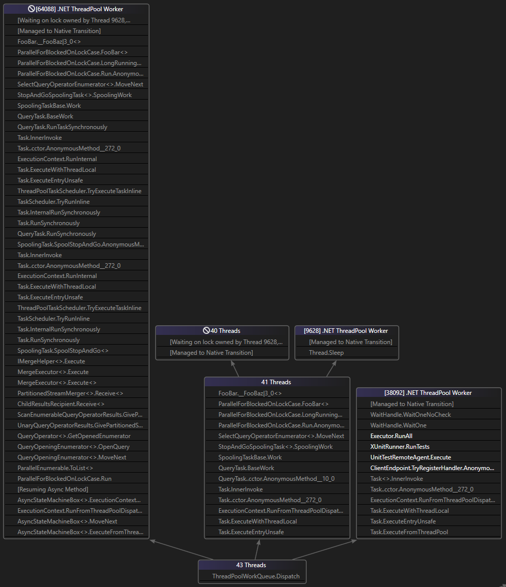
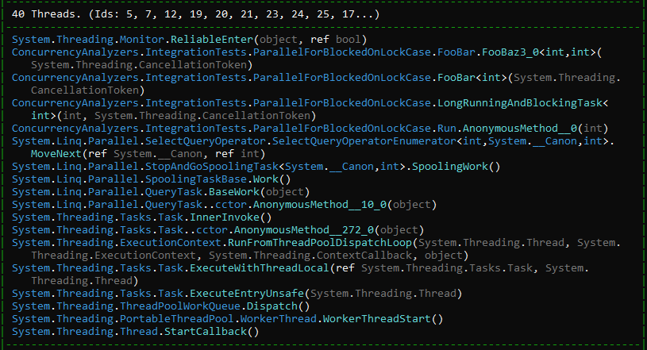
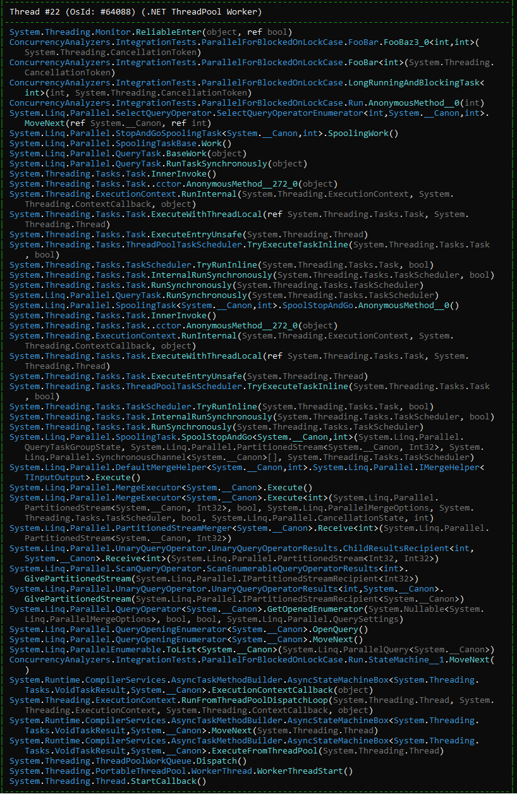

# Concurrency Analyzers
This project contains a set of post-mortem analyzers for discovering threading/tasks issue in a dump or a process based based on [Microsoft.Diagnostics.Runtime](https://github.com/microsoft/clrmd) a.k.a. ClrMD.

## Why do you need something like that?
Visual Studio has a very powerful capabilities for post-mortem analysis via "Parallel Threads/Tasks" view and other goodies, but its not always easy or even possible to use it in a production environment. The other tools like WinDbg is almost always available, but they may be a bit too low level and hard to get a big picture of a problematic process.

The Concurrency Analyzers are designed to get a simple but useful analysys of a dump file or a running process, like an overview of all the threads with their unique stack traces, the state of the thread pool or task-to-task dependency diagram.

As of right now only the "Parallel Threads" mode is implemented but the plan is to add more features in the future.

## Parallel Threads

The default use case for this tool for now is to dump all the threads stack traces in a grouped manner. This is kind of what 'Parallel Threads' window does in Visual Studio, but without causality linkes between threads.

Here is an example:

```csharp
public class ParallelForBlockedOnLockCase
{
    private static readonly object _globalSyncLock = new object();

    public static async Task Run(int threadCount, CancellationToken token)
    {
        // Detaching from the calling thread since the ForEachAsync is actually a blocking call.
        await Task.Yield();
        var source = Enumerable.Range(1, 1000);
        source.AsParallel().WithDegreeOfParallelism(threadCount).Select(n => LongRunningAndBlockingTask<int>(n, token)).ToList();
    }

    private static Task<T> LongRunningAndBlockingTask<T>(int n, CancellationToken token)
    {
        return Task.FromResult(FooBar<T>(token));
    }

    private static T FooBar<T>(CancellationToken token)
    {
        return FooBaz<T>(token);

        static T FooBaz<U>(CancellationToken token)
        {
            lock (_globalSyncLock)
            {
                // This will allow breaking the method once token is requested.
                if (!token.IsCancellationRequested)
                {
                    Console.WriteLine("Sleep inside the lock!");
                    Thread.Sleep(1000);
                }
            }

            return default;
        }
    }
}
```

Running this code will cause a lot of contention on a lock with a bunch of threads having very similar stack traces.

Here is an output from Visual Studio Parallel Windows:


And here is the output from this tool when ran from the command line (the output is trimmed for readability purposes. You can always run a test `ParallelThreadsIntegrationTests.ParallelForBlockedOnLock` to see the full output):




### Supported features
* Enhanced Stack frame names compared to the raw stack frames obtained from "ClrMd" (this is quite a challenging thing to do, actually).
* Grouping similar stack traces to see a big picture of what is going on.
* Show the current exception on a stack.
* Show the number of locks acquired by a thread (it seems that ClrMd does not only support this feature for CoreCLR).

### Limitations
* I was unable to figure out how obtain what thread owns a lock.

## Next steps
* Analyze thread pool statistics
* Analyze tasks to get a very simple causaility diagram (task to task dependencies), very similar to 
* Add support for `Analyze` verb to get 